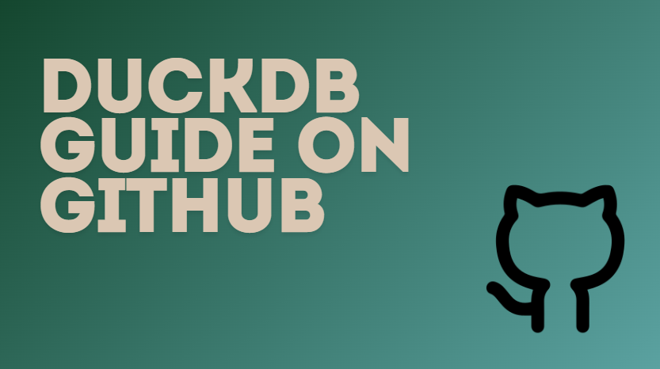

After completing this guide,
You will be able to:
- Work with DuckDB a modern OLAP (Analytical) Database
- Hone your SQL Skills
- use duckdb in python (In progress)

I hope you use this free resource.

<!---[Get Started Here](/getting-started/) --->