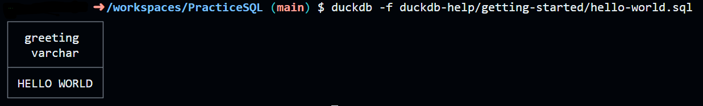

### Once you have setup duckdb and verified it's installed

~~~bash
duckdb --help
~~~

## Run a SQL File

1. Copy the relative path of the file you wish to execute 
(using the GUI or CTRL + Shift + C in VSCode)

2. in the CLI enter
~~~bash
duckdb -f filename
~~~

##### Run this
~~~bash
duckdb -f duckdb-help/getting-started/hello-world.sql
~~~

#### If you got this you can head to [reading a file](../reading-a-file.md)