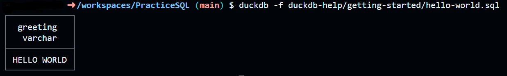

### Once you have setup duckdb and verified it's installed

~~~bash
duckdb --help
~~~

## Run a SQL File

1. Copy the relative path of the file you wish to execute 
(using the GUI or CTRL + Shift + C in VSCode)

2. in the CLI enter
~~~bash
duckdb -f filename
~~~



#### Run this
~~~bash
duckdb -f getting-started/hello-world.sql
~~~
Alternatively
```sh
duckdb
# You have entered the CLI
.read getting-started/hello-world.sql
.exit
# you exited
```
#### Using a Database file
~~~bash
duckdb datasets/date.duckdb -f questions/4/solution.sql
~~~ 

#### Using the -c flag
~~~bash
duckdb -c "SELECT 'hello world';"
~~~

#### If you got this you can head to [reading a file](../duckdb-help/reading-a-file.md)